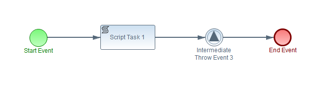
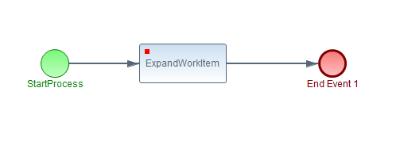

# Jbpm examples

A set of example using [Jbpm](http://www.jbpm.org/) an open source business process management project from [Jboss community](http://www.jboss.org/). Jbpm implemens JBPMN 2.0 standard.

## Usage

In order to use this project you must install:

* java 8
* maven 3.3.3 
* a development Ide ( Suggested: Eclipse, 4.5.2 )

To compile and run test just run: *mvn test*

## Examples

### Hello World

Activities:

 * start
 * a script task that output "Hello World" on system out
 * end

### ProcessId 

Activities:

 * start
 * script task: output "Hi, my process id is 1" on system out. *Note that is possibile in script task get current process instance information*
 * end

### CreateInstances

Activities:

 * start
 * script task: print process Id information
 * end
 
Using jbpm api it's possible to create more instances for the same process definition. In this test, we will create 10 process instance from this process definition

### SignalProcess

Activities:

 * start: a normal start, activate process when process start
 * throw event: use Signal to activate the second flow of activities
 * start event 2: activated after signal is throwned 
 * script task: print "Hello after catch" on system out
 * ends: end events
 
Using signal it's possible to activate other flows and continue with execution

### DataMessage

Activities:

 * start: a normal start, activate process when process start
 * script task 1: set a process variable with a value (processVar1="Jbpm")
 * throw event: use Signal to activate the second flow of activities and passing processVar1
 * start event 3: activated after signal is throwned, copy processVar1 to processVar2 
 * script task 2: print to system out processVar2 value
 * ends: end events
 
Using signal it's possible to activate other flows and continue with execution

### CustomDataMessage

Activities:

 * start: a normal start, activate process when process start
 * script task 1: set a process variable using a custom class: CustomMessage (with sender id and the message)
 * throw event: use Signal to activate the second flow of activities and passing processVar1
 * start event 3: activated after signal is throwned, copy processVar1 to processVar2 
 * script task 2: print to system out "Received message Jbpm rocks! from process with id 1"
 * ends: end events
 
Using signal it's possible to activate other flows and continue with execution and in particular comunicate with custom data structure defined by user, not only base classes

### Two processes

In this example there are two different process definitions, as following:

 * start: a normal start, activate process when process start
 * script task 1: set a process variable using a custom class: CustomMessage (with sender id and the message)
 * throw event: use Signal to activate the second flow of activities and passing processVar1
 * end

 * start event: activated after signal is throwned, copy processVar1 to processVar2 
 * script task 2: print to system out "Received message Jbpm rocks! from process with id 1"
 * end

Using KieHelper is possible to create a KieBase with many different processes definitions and in load them into memory. This case is same as before, but two different process definitions 

### External service

Activities:

 * start
 * RestWorkItemHandler: throught a script and using a custom class call GET method using REST on a page on internet
 * end 

Using a script class is easy to call an external service

### Extending using Custom WorkItemHandler

Activities:

 * start: 
 * TestWorkItem: a domain specific task, see [domain specific processes on Jbpm manual](http://docs.jboss.org/jbpm/release/6.4.0.Final/jbpm-docs/html/ch21.html)
 * end 

Using Jbpm capabilities to extend basic task, it's possible to create custom task with custom logic and reuse them.
Be aware to specificy I/O Data Mappings into TestWorkItem task and see [TestWorkItem.java](src/main/java/examples/testWorkItem/TestWorkItem.java) custom task implementation  

### Expand process at runtime 

Activities:

 * start
 * ExpandWorkItem: a domain specific task, see [domain specific processes on Jbpm manual](http://docs.jboss.org/jbpm/release/6.4.0.Final/jbpm-docs/html/ch21.html)
 * end

Activities:

 * start
 * Script Task 1: prints hello world to system out
 * end 
 
This example shows how, using Jbpm WorkItemHandler, it's possible to "expand" first process calling second one. See [ExpandWorkItem.java](src/main/java/example/expand/ExpandWorkItem.java) for complete code.

# License

See LICENSE file
